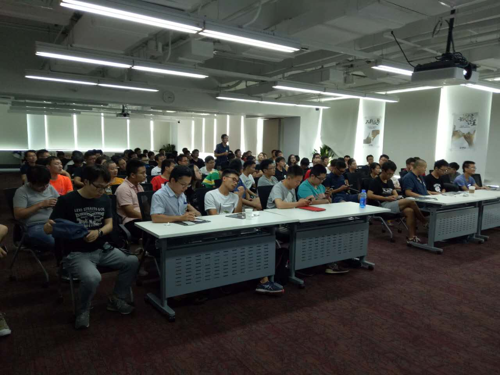
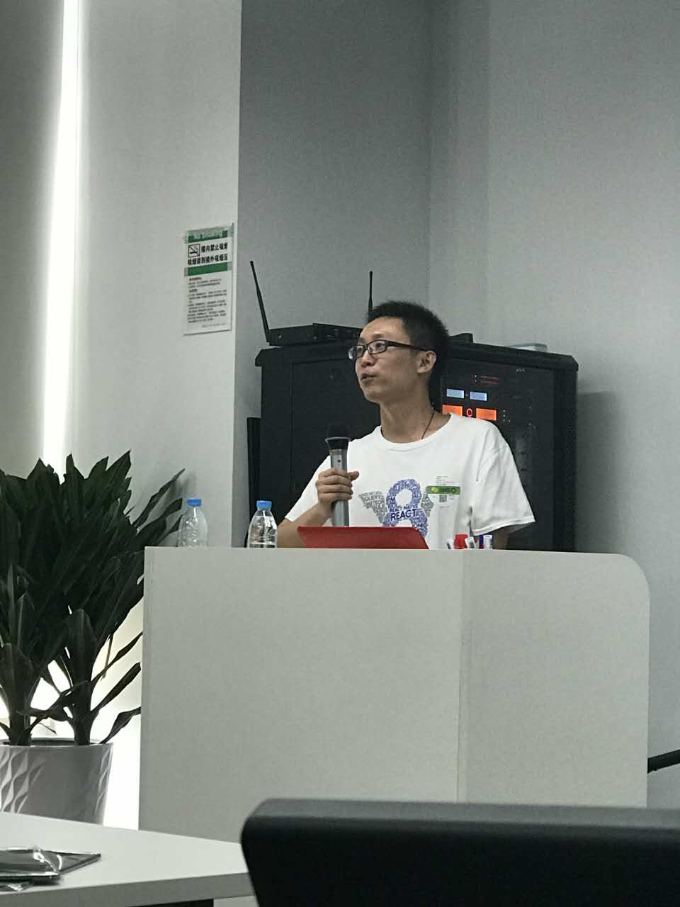
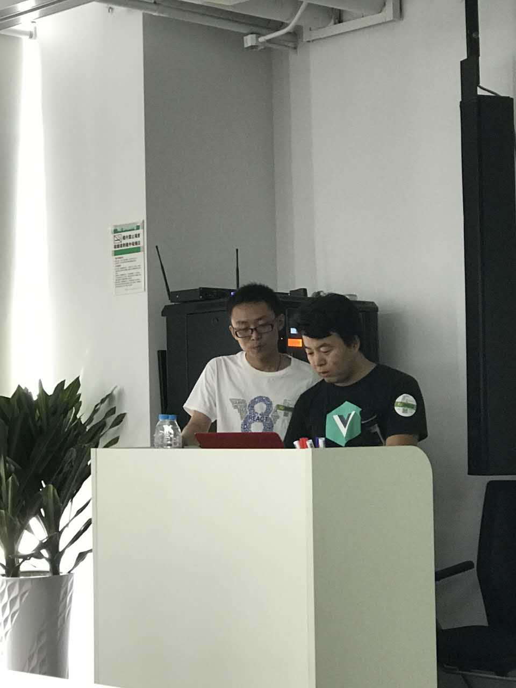
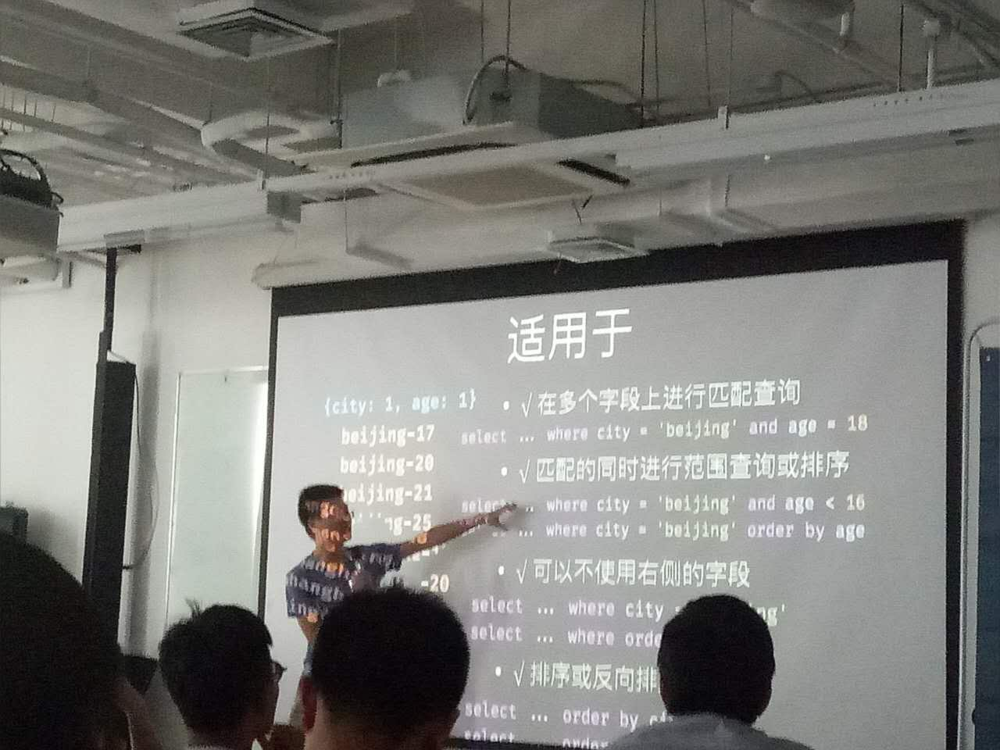
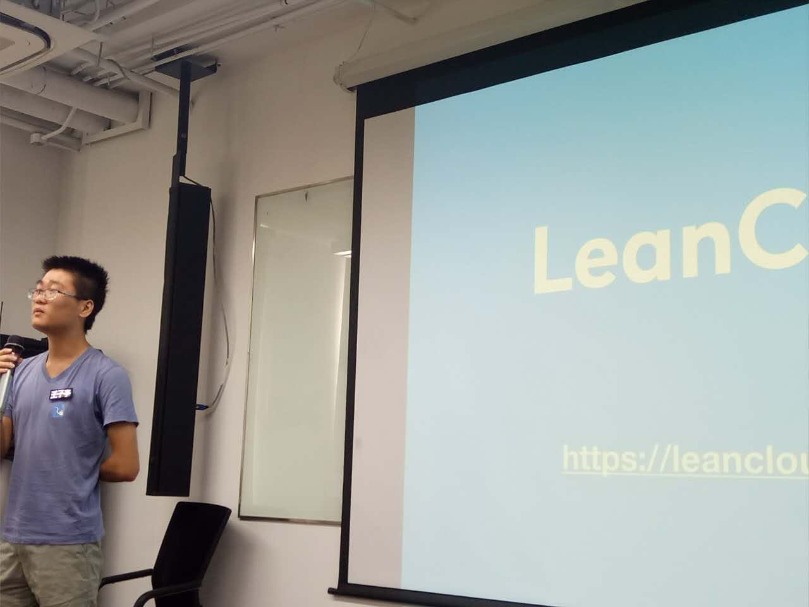
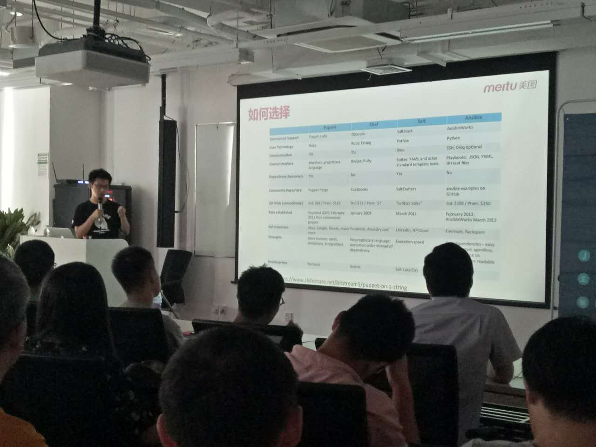
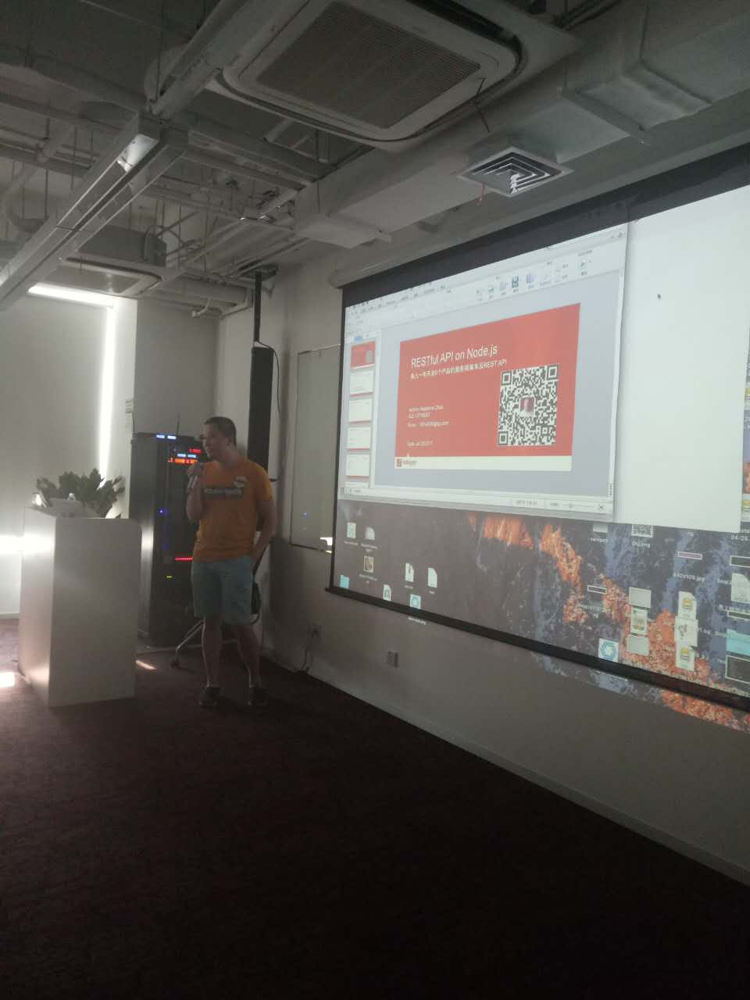

# nodeparty-ppt-20170729

北京7月29日Node Party线下活动（周六）下午2点到6点，将近100人，二次筛选后的基本都到了，5位讲师（justjavac，精子，@stonephp，张晋涛，胡戎），场地由裕波（360的波大）赞助，茶歇由stuq赞助（第一次办，没资源，厚着脸皮找stuq要的），晚上在很久以前羊肉串AA聚餐（我结的账，然后微信群AA付款，大家都付款了，非常厚道）。

首先要说一下，为啥要组织一次这样的活动，最近很久没有纯node的活动了，而go类的活动非常多，前端也多，但大家都默认node流行，这其实对于node社区来说并不好，所以还是需要适当的曝光，我是非常希望大家能够多组织这样的活动，为社区繁荣，为大家能有一个更好的学习交流环境，我个人会尽全力去帮忙。

> 对于node party是node社区下的品牌，大家都可以组织node party活动，唯一的要求是要node相关，请大家注意！cnode官方会支持大家组织活动

## 主题分享

**justjavac（jjc）《面向前端程序员的 V8 知识》**

狼叔点评：v8的内容略深，但介乎于chrome浏览器原理和node之间，是优化，了解原理必备技能。讲之前我就知道效果不会特别好，怕大家听不太懂，但能够让大家了解这些，有优化意识其实就足够了。jjc的演讲风格也非常好，非常逗。

QA环节，有人问jjc如何看大型项目源码，这个问题太麻烦了，希望jjc能写篇文章，对大家也能有帮助。

不知道谁偷拍的，狼叔显胖

**王子亭（精子）《如何通过索引加速数据库查询》** 

王子亭（精子），知名程序员，1995 年生于辽宁沈阳，现居江苏苏州，目前在 LeanCloud 任 Node.js 服务器端开发工程师。

- 什么是索引、二分查找、B-Tree
- 单字段索引：可加速哪些查询、不可加速哪些查询
- 复合索引：可加速哪些查询、不可加速哪些查询
- 索引的区分度、选择合适的字段
- 如何创建索引
- 索引的属性：主键、唯一、稀疏、TTL、数组

狼叔点评：子亭非常年轻，这篇分享对索引知识的涵盖还是相当不错的，从原理到各种例子讲解，虽然是以 MongoDB 为例，但举例的是sql，所以也适用 MySQL等关系型数据库。数据库运维优化是非常重要的一个领域，目前node社区存在一个问题，就是单一技能，用node就只是用node，其实tps如果卡住，你一样无法做到性能很好的系统。子亭自己带了一个发光的名牌，非常有趣，最后还送了大家很多精子头像的帖子！

**张晋涛《DevOPS 的养成之道》**

个人介绍： 张晋涛，网名 TaoBeier，美图公司 DevOPS 工程师。长期沉迷于二次元的程序猿。

狼叔点评：选题时我和晋涛聊过，他对devops理解，很多开发工具实践都非常不错，虽然我没见过他，但对其水平还是相当认可的，这次分享ppt的前几页吓我一跳，基本都大标题，不过还好后面分享了美图的自动化运维实践，每周4000次的发布，基于ansible的经验分享，这部分社区内分享的不多。我个人认为需要有这样专业的人才来分享更多相关内容，这对node来说是必要的。ps：晋涛的电脑桌面很二次元，哈哈

**赵雄飞(stonephp)《Node.js 下 restful 最佳实践》** 

狼叔点评：精硕的首席架构师 赵雄飞（@stonephp）是cnode非常活跃的会员，他早年是写php的，所以对比php和node，讲的太直接，把现场很多人都逗乐了，他这次主要分享他写的框架https://github.com/open-node/open-rest，此框架在精硕落地多年，在多个系统里深度实践总结的一个框架。其业务深度，约定思想，快速开发等是非常值得借鉴的。现场演示代码，没视频录制，有点可惜。

**胡戎《DDD领域模型与微服务拆分》**

狼叔点评：核心3部分：介绍DDD领域模型微服务，领域模型微服务拆分落地，GraphQL API设计，这次时间给的有点少，而且这个主题相对来说比深，是很多人不太熟悉的领域，不过是很好的话题，希望大家能够多多讨论。

## 欢迎大家也多多组织node party，社区会尽力帮忙

如果有想组织node party，社区会尽力帮忙, i5ting@126.com